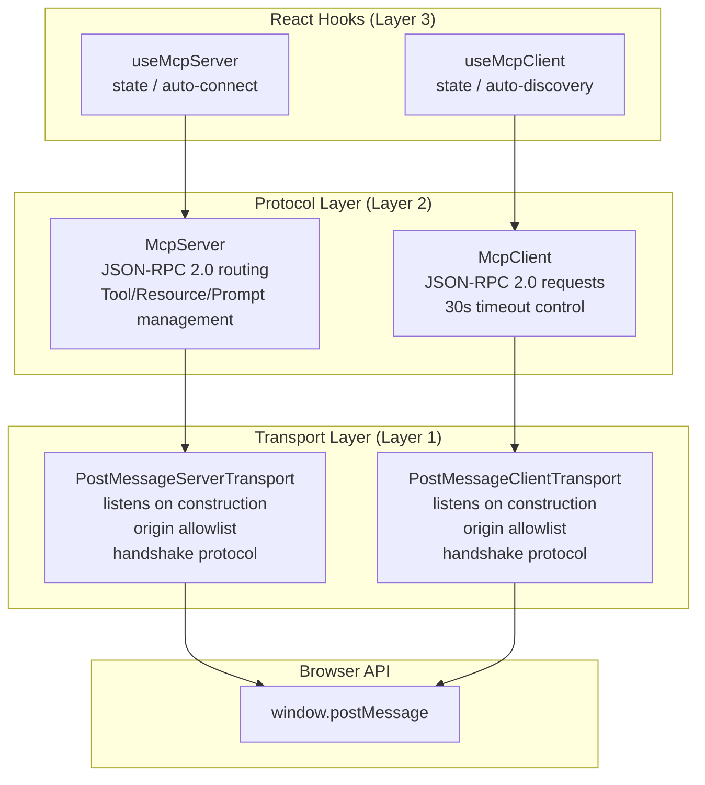
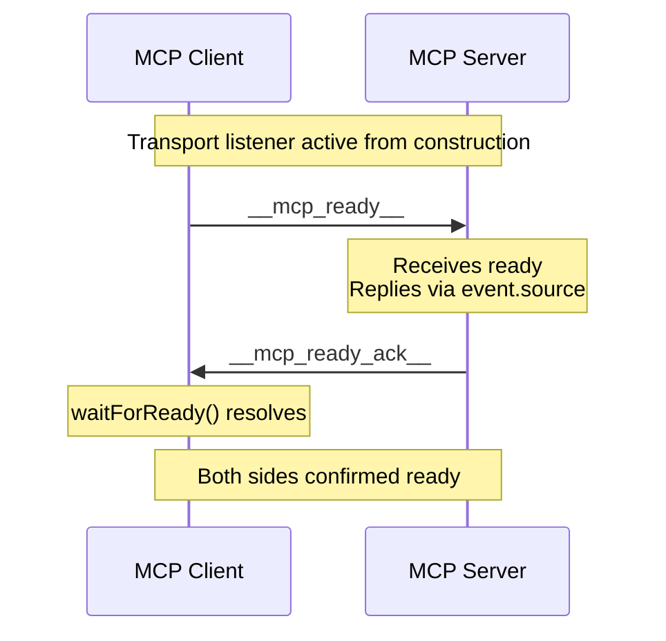
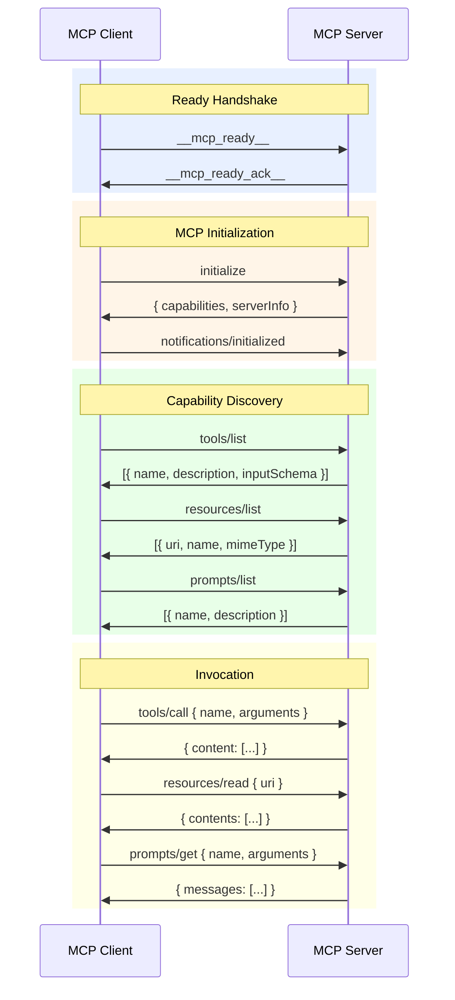
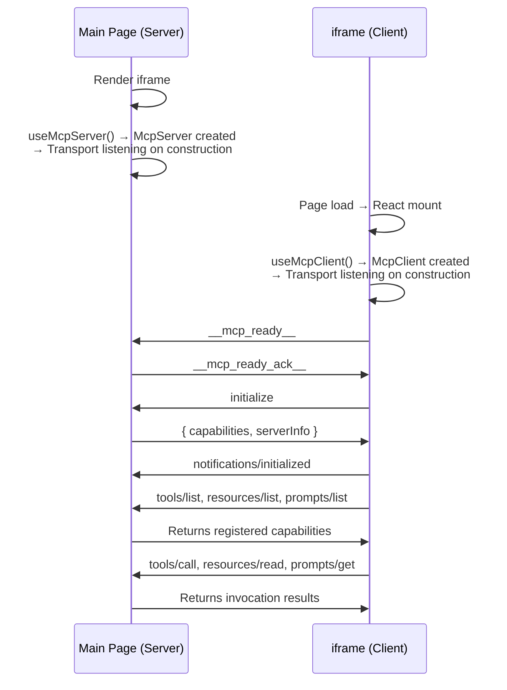
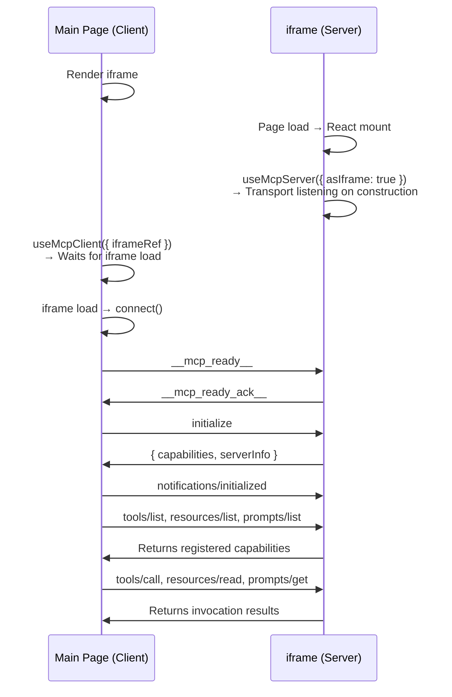

# postmessage-mcp Specification

## Overview

**postmessage-mcp** is a TypeScript library that implements the [Model Context Protocol (MCP)](https://modelcontextprotocol.io) on top of the browser `window.postMessage` API. It establishes a bidirectional JSON-RPC 2.0 communication channel between a main page and an iframe (or any two windows), allowing one side to act as an MCP **Server** (exposing tools, resources, and prompts) and the other as an MCP **Client** (discovering and invoking those capabilities).

### Core Features

- **Full MCP Lifecycle**: initialize, tools/list, tools/call, resources/list, resources/read, prompts/list, prompts/get, ping
- **Two Operating Modes**: Normal mode (main page as Server, iframe as Client) and Reverse mode (iframe as Server, main page as Client)
- **Cross-Origin Security**: Built on native `window.postMessage`, supports origin allowlist with wildcard matching
- **React Hooks**: First-class `useMcpServer` / `useMcpClient` hooks with auto-connect, auto-discovery, and state management
- **Framework-Agnostic Core**: `McpServer` and `McpClient` classes can be used independently of React
- **Timeout Handling**: 30-second request timeout with automatic cleanup
- **Type Safety**: Full TypeScript support with exported type definitions for all parameters and return values

---

## Architecture



### Layer 1: Transport

Encapsulation of the native `window.postMessage` API, implementing the `Transport` interface from `@modelcontextprotocol/sdk`.

- **PostMessageServerTransport** — Registers the `addEventListener('message')` listener **on construction**, so messages are captured regardless of `start()` call timing.
- **PostMessageClientTransport** — Same: listener starts on construction. Default target is `window.parent` (normal iframe mode). Supports explicit target specification for reverse mode.
- **Handshake Mechanism** — The transport layer internally handles `__mcp_ready__` / `__mcp_ready_ack__` handshake messages. The receiver replies with ack via `event.source`, no prior target window reference needed.
- **Origin Validation** — Allowlist checking via the `isOriginAllowed()` utility function, supporting three modes: exact match, `*.domain` wildcard, and `https://*.domain` wildcard. When `allowedOrigins` is empty or undefined, all origins are allowed.
- **`createPostMessageListener()` / `sendPostMessage()`** — Native postMessage utility functions usable independently of Transport classes.

### Layer 2: Protocol

Implements MCP protocol on top of JSON-RPC 2.0.

- **McpServer** — Registers tools, resources, and prompts with their handlers. Listens for incoming JSON-RPC requests and dispatches them to the appropriate handlers. Returns JSON-RPC error responses (`-32601`) for unknown methods, and `-32000` for handler exceptions. The `initialize` response only declares a capability when at least one of that type is registered.
- **McpClient** — Sends JSON-RPC requests with incrementing IDs, matching responses to pending promises via `Map<id, {resolve, reject}>`. Each request has a mandatory 30-second timeout. `connect()` waits for the ready handshake before sending MCP `initialize`.

### Layer 3: React Hooks

- **useMcpServer** — Creates a singleton `McpServer`, auto-connects on mount (handles both normal and reverse modes), exposes `addTool/removeTool/addResource/removeResource/addPrompt/removePrompt` methods (all wrapped with `useCallback`).
- **useMcpClient** — Creates a singleton `McpClient`, auto-connects, optional auto-discovery of capabilities (`listTools/listResources/listPrompts`), exposes `callTool/readResource/getPrompt/refreshTools` methods.

---

## Handshake Mechanism

The Transport sets up its `message` listener in the constructor, ensuring no messages are lost due to `start()` call timing. The connection flow has two phases:

### Phase 1: Ready Handshake



- **Client** sends `__mcp_ready__` and waits for ack via `waitForReady()`
- **Server** receives `__mcp_ready__` and replies with `__mcp_ready_ack__` via `event.source.postMessage()`, no prior Client window reference required
- If the Server sends ready first, the Client replies with ack; either side receiving the other's ready or ack completes the handshake

### Phase 2: MCP Communication



---

## Communication Flow

### Normal Mode (Main Page as Server, iframe as Client)



### Reverse Mode (iframe as Server, Main Page as Client)



---

## API Reference

### McpServer

```typescript
class McpServer {
  constructor(options?: McpServerOptions)

  // Connection
  connect(target: Window | HTMLIFrameElement | string, options?: ServerTransportOptions): Promise<void>
  disconnect(): void
  getState(): TransportState

  // Tools
  addTool(definition: ToolDefinition): void
  removeTool(name: string): boolean
  getTools(): ToolInfo[]

  // Resources
  addResource(definition: ResourceDefinition): void
  removeResource(uri: string): boolean
  getResources(): ResourceInfo[]

  // Prompts
  addPrompt(definition: PromptDefinition): void
  removePrompt(name: string): boolean
  getPrompts(): PromptInfo[]
}
```

**McpServerOptions:**

| Property | Type | Default | Description |
|---|---|---|---|
| `name` | `string` | `"postmessage-mcp-server"` | Server name reported in `initialize` response |
| `version` | `string` | `"0.0.1"` | Server version |

### McpClient

```typescript
class McpClient {
  constructor(options?: McpClientOptions)

  // Connection
  connect(transportOptions?: ClientTransportOptions): Promise<void>
  disconnect(): void
  getState(): ClientState
  getServerInfo(): ServerInfo | null

  // Tools
  listTools(): Promise<Tool[]>
  callTool(name: string, args?: Record<string, unknown>): Promise<ToolCallResult>
  callTool(params: CallToolParams): Promise<ToolCallResult>

  // Resources
  listResources(): Promise<Resource[]>
  readResource(uri: string): Promise<ResourceContents[]>
  readResource(params: ReadResourceParams): Promise<ResourceContents[]>

  // Prompts
  listPrompts(): Promise<Prompt[]>
  getPrompt(name: string, args?: Record<string, string>): Promise<GetPromptResult>
  getPrompt(params: GetPromptParams): Promise<GetPromptResult>

  // Utilities
  ping(): Promise<void>
}
```

**McpClientOptions:**

| Property | Type | Default | Description |
|---|---|---|---|
| `name` | `string` | `"postmessage-mcp-client"` | Client name sent in `initialize` request |
| `version` | `string` | `"0.0.1"` | Client version |

### React Hooks

#### useMcpServer

```typescript
function useMcpServer(options?: UseMcpServerOptions): UseMcpServerReturn

interface UseMcpServerOptions {
  name?: string
  version?: string
  iframeRef?: RefObject<HTMLIFrameElement | null>
  asIframe?: boolean           // Reverse mode: Server runs in iframe
  autoConnect?: boolean        // Default: true
  serverOptions?: McpServerOptions
  transportOptions?: ServerTransportOptions
}

interface UseMcpServerReturn {
  server: McpServer | null
  isConnected: boolean
  error: Error | null
  connect: () => Promise<void>
  disconnect: () => void
  addTool: (def: ToolDefinition) => void
  removeTool: (name: string) => boolean
  addResource: (def: ResourceDefinition) => void
  removeResource: (uri: string) => boolean
  addPrompt: (def: PromptDefinition) => void
  removePrompt: (name: string) => boolean
}
```

#### useMcpClient

```typescript
function useMcpClient(options?: UseMcpClientOptions): UseMcpClientReturn

interface UseMcpClientOptions {
  name?: string
  version?: string
  iframeRef?: RefObject<HTMLIFrameElement | null>  // Used in reverse mode
  autoConnect?: boolean       // Default: true
  autoFetch?: boolean         // Auto-discover capabilities after connection
  clientOptions?: McpClientOptions
  transportOptions?: ClientTransportOptions
}

interface UseMcpClientReturn {
  client: McpClient | null
  state: ClientState
  isConnected: boolean
  error: Error | null
  serverInfo: ServerInfo | null
  tools: Tool[]
  resources: Resource[]
  prompts: Prompt[]
  connect: () => Promise<void>
  disconnect: () => void
  refreshTools: () => Promise<void>
  refreshResources: () => Promise<void>
  refreshPrompts: () => Promise<void>
  callTool: (name: string, args?: Record<string, unknown>) => Promise<ToolCallResult>
  readResource: (uri: string) => Promise<ResourceContents[]>
  getPrompt: (name: string, args?: Record<string, string>) => Promise<GetPromptResult>
}
```

### Transport

```typescript
// Factory functions
function createServerTransport(options?: ServerTransportOptions): PostMessageServerTransport
function createClientTransport(options?: ClientTransportOptions): PostMessageClientTransport

// Configuration
interface ServerTransportOptions {
  target?: Window | HTMLIFrameElement | string
  targetOrigin?: string
  allowedOrigins?: string[]
}

interface ClientTransportOptions {
  target?: Window | HTMLIFrameElement | string
  parent?: Window                                    // Deprecated
  targetOrigin?: string
  allowedOrigins?: string[]
}
```

### Core Types

```typescript
type ClientState = "disconnected" | "connecting" | "connected" | "error"

interface ToolDefinition {
  name: string
  description: string
  inputSchema: JSONSchema
  handler: (input: ToolCallInput) => Promise<ToolCallResult>
}

interface ResourceDefinition {
  uri: string
  name: string
  description?: string
  mimeType?: string
  handler: (uri: string) => Promise<ResourceContents[]>
}

interface PromptDefinition {
  name: string
  description?: string
  arguments?: PromptArgument[]
  handler: (args?: Record<string, string>) => Promise<GetPromptResult>
}

interface ServerInfo {
  name: string
  version: string
}
```

---

## MCP Method Support

| Method | Direction | Description |
|---|---|---|
| `initialize` | Client → Server | Capability handshake |
| `notifications/initialized` | Client → Server | Confirm initialization complete |
| `tools/list` | Client → Server | Discover available tools |
| `tools/call` | Client → Server | Invoke a tool with arguments |
| `resources/list` | Client → Server | Discover available resources |
| `resources/read` | Client → Server | Read a resource by URI |
| `prompts/list` | Client → Server | Discover available prompts |
| `prompts/get` | Client → Server | Get a prompt with arguments |
| `ping` | Client → Server | Heartbeat / connectivity check |

---

## Origin Security

The transport layer supports three origin allowlist matching modes:

| Mode | Scope |
|---|---|
| `https://example.com` | Exact match on the specified origin |
| `*.example.com` | Any subdomain of example.com (any protocol) |
| `https://*.example.com` | Any subdomain of example.com (HTTPS only) |

When `allowedOrigins` is empty or `undefined`, **all origins are allowed**. Always set `allowedOrigins` in production to restrict communication origins.

---

## Project Structure

```
src/lib/           # Library source (published to npm)
  index.ts         # Public barrel export
  client/          # McpClient class + type definitions
  server/          # McpServer class + type definitions
  hooks/           # useMcpServer / useMcpClient React hooks
  transport/       # PostMessage transport layer
src/               # Example app (not published)
  App.tsx          # Server-side example component
  ClientApp.tsx    # Client-side example component
  DemoApp.tsx      # Split layout (Server + Client iframe)
  main.tsx         # Main page entry
  client.tsx       # iframe entry
  App.css          # Example styles
  client.css       # iframe reset styles
index.html         # Main page HTML
client.html        # iframe page HTML
```

### Build Artifacts

| Command | Output | Purpose |
|---|---|---|
| `pnpm build` | `dist/` | Vite app bundle (example) |
| `pnpm build:lib` | `dist-lib/` | Library bundle (npm publish) |
| `pnpm dev` | Dev server | `localhost:5173` local development |

---

## Dependencies

| Package | Version | Purpose |
|---|---|---|
| `@modelcontextprotocol/sdk` | ^1.25.1 | MCP type definitions (`Transport` interface, `Tool`, `Resource`, `Prompt`, `JSONRPCMessage`) |
| `react` (peer) | 18.x / 19.x | Only needed when using hooks |
| `react-dom` (peer) | 18.x / 19.x | Only needed when using hooks |

### Dev Toolchain

- **Vite** (based on `rolldown-vite`): Build and dev server
- **TypeScript**: Strict mode, ES2022 target
- **ESLint**: `@eslint/js` + `typescript-eslint` + `react-hooks` + `react-refresh`

---

## Usage Examples

### Framework-Agnostic (Core API)

```typescript
import { McpServer, McpClient } from "postmessage-mcp"

// Server (main page)
const server = new McpServer({ name: "my-server", version: "1.0.0" })
server.addTool({
  name: "greet",
  description: "Greet a user",
  inputSchema: {
    type: "object",
    properties: { name: { type: "string" } },
    required: ["name"]
  },
  handler: async (input) => ({
    content: [{ type: "text", text: `Hello, ${input.arguments.name}!` }]
  })
})
await server.connect(iframeElement)

// Client (iframe)
const client = new McpClient({ name: "my-client", version: "1.0.0" })
await client.connect()
const tools = await client.listTools()
const result = await client.callTool("greet", { name: "World" })
```

### React Hooks

```tsx
// Server component (main page)
function ServerPanel({ iframeRef }) {
  const { isConnected, addTool } = useMcpServer({ iframeRef })

  useEffect(() => {
    addTool({
      name: "greet",
      description: "Greet a user",
      inputSchema: {
        type: "object",
        properties: { name: { type: "string" } }
      },
      handler: async (input) => ({
        content: [{ type: "text", text: `Hello, ${input.arguments.name}!` }]
      })
    })
  }, [addTool])

  return <div>Server: {isConnected ? "Connected" : "Disconnected"}</div>
}

// Client component (iframe)
function ClientPanel() {
  const { isConnected, tools, callTool } = useMcpClient({
    autoConnect: true,
    autoFetch: true
  })

  const handleGreet = async () => {
    const result = await callTool("greet", { name: "World" })
    console.log(result)
  }

  return (
    <div>
      <p>Connection: {isConnected ? "Connected" : "Disconnected"}</p>
      <p>Tools: {tools.map(t => t.name).join(", ")}</p>
      <button onClick={handleGreet}>Greet</button>
    </div>
  )
}
```

### Reverse Mode

```tsx
// Main page (Client)
function MainPage() {
  const iframeRef = useRef<HTMLIFrameElement>(null)
  const { isConnected, tools, callTool } = useMcpClient({ iframeRef })

  return (
    <div>
      <iframe ref={iframeRef} src="/server-iframe.html" />
      {/* Client discovers and calls tools exposed by the iframe */}
    </div>
  )
}

// iframe (Server)
function ServerIframe() {
  const { isConnected, addTool } = useMcpServer({ asIframe: true })

  useEffect(() => {
    addTool({
      name: "iframe_tool",
      description: "A tool running in the iframe",
      inputSchema: { type: "object", properties: {} },
      handler: async () => ({
        content: [{ type: "text", text: "Greetings from the iframe!" }]
      })
    })
  }, [addTool])

  return <div>Iframe Server: {isConnected ? "Connected" : "Disconnected"}</div>
}
```

---

## JSON-RPC Error Codes

| Code | Meaning |
|---|---|
| `-32601` | Method not found — the requested MCP method is unrecognized |
| `-32000` | Server error — the registered handler threw an exception during execution |
