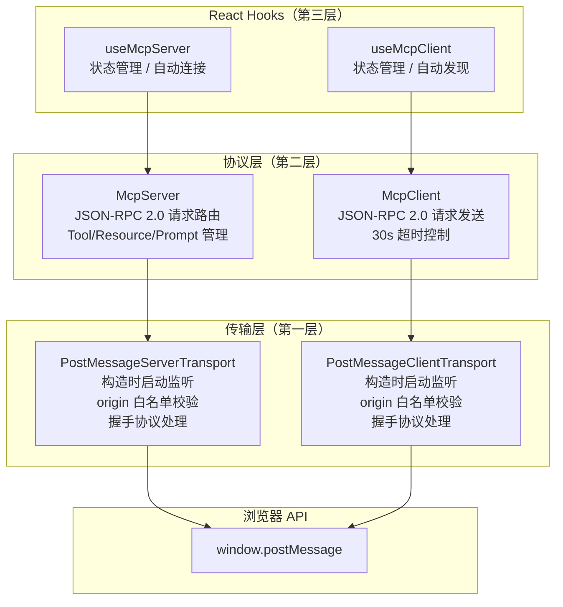
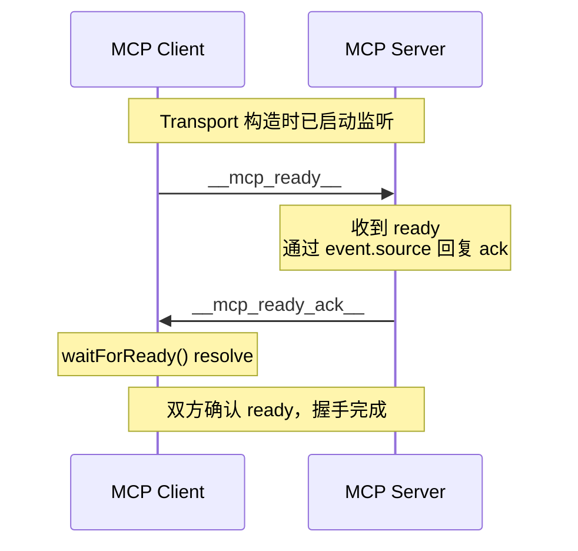
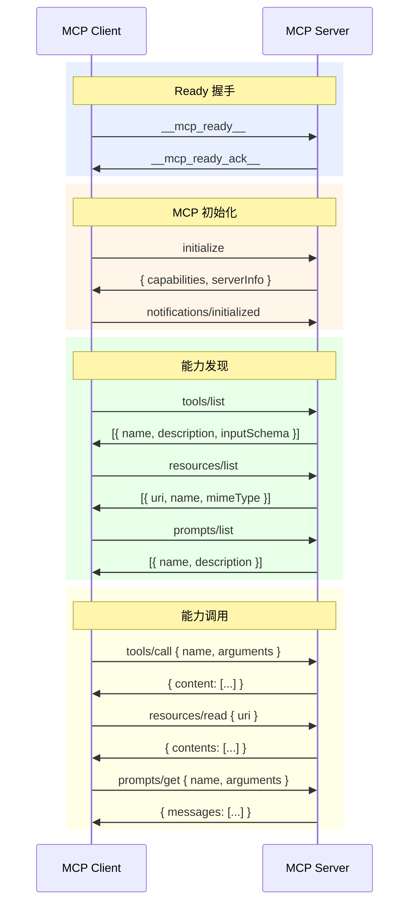
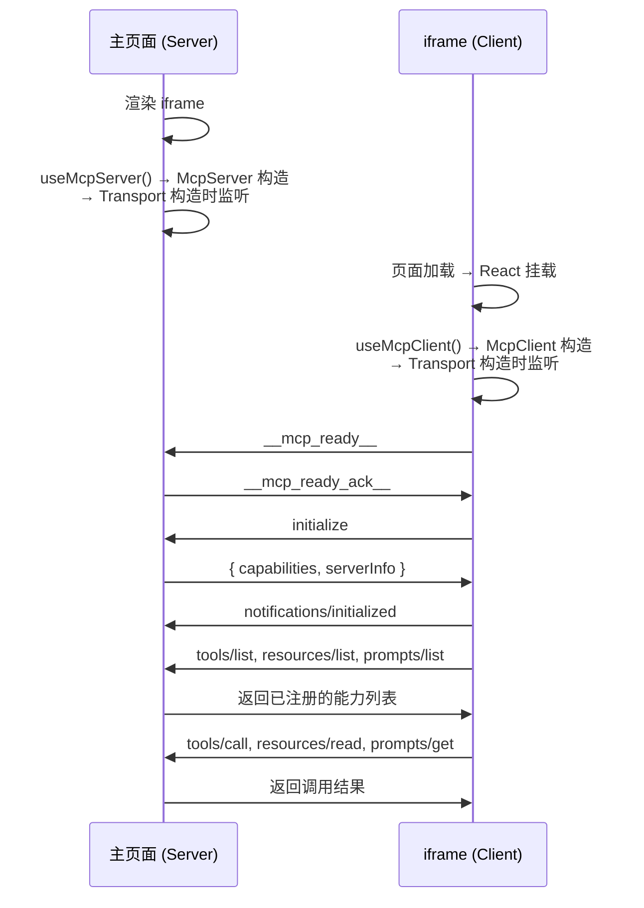
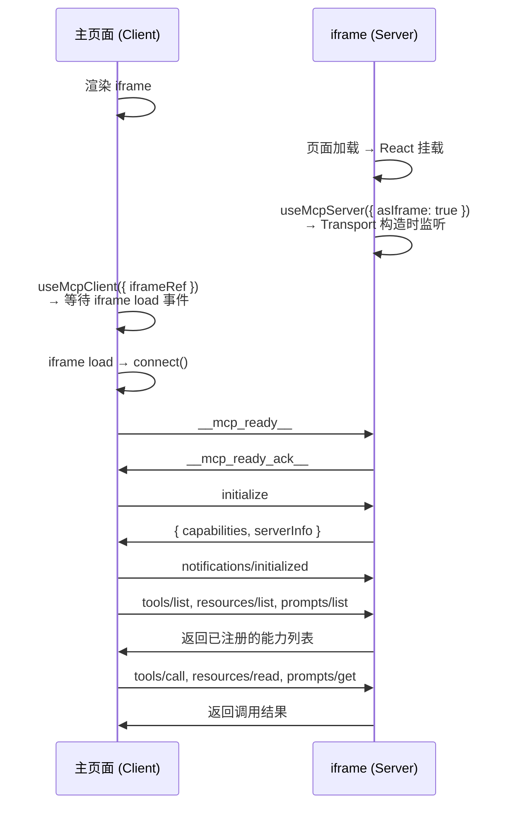

# postmessage-mcp 规范文档

## 概述

**postmessage-mcp** 是一个 TypeScript 库，在浏览器 `window.postMessage` API 之上实现了 [Model Context Protocol (MCP)](https://modelcontextprotocol.io)。它在主页面与 iframe（或任意两个窗口）之间建立双向 JSON-RPC 2.0 通信通道，使一端充当 MCP **Server**（暴露工具、资源和提示词），另一端充当 MCP **Client**（发现并调用这些能力）。

### 核心特性

- **完整 MCP 生命周期**：initialize、tools/list、tools/call、resources/list、resources/read、prompts/list、prompts/get、ping
- **两种运行模式**：普通模式（主页面为 Server，iframe 为 Client）与反向模式（iframe 为 Server，主页面为 Client）
- **跨域安全**：基于原生 `window.postMessage` 实现，支持 origin 白名单与通配符匹配
- **React Hooks**：提供 `useMcpServer` / `useMcpClient` 一等公民 hooks，支持自动连接、自动发现与状态管理
- **框架无关核心**：`McpServer` 与 `McpClient` 类可脱离 React 独立使用
- **超时处理**：请求 30 秒超时，自动清理
- **类型安全**：完整 TypeScript 支持，所有参数与返回值均有导出类型定义

---

## 架构



### 第一层：传输层

基于原生 `window.postMessage` API 封装，实现 `@modelcontextprotocol/sdk` 的 `Transport` 接口。

- **PostMessageServerTransport** — **构造时**即通过 `addEventListener('message')` 注册监听器，消息到达即处理，不依赖 `start()` 调用时机。
- **PostMessageClientTransport** — 同上，构造时启动监听。默认目标为 `window.parent`（普通 iframe 模式）。支持显式指定目标以启用反向模式。
- **握手机制** — 传输层内部处理 `__mcp_ready__` / `__mcp_ready_ack__` 握手消息。接收方通过 `event.source` 回复 ack，无需预先知道目标窗口引用。
- **Origin 校验** — 通过 `isOriginAllowed()` 工具函数进行白名单校验，支持精确匹配、`*.domain` 通配符和 `https://*.domain` 通配符三种模式。当 `allowedOrigins` 为空或未定义时，允许所有来源。
- **`createPostMessageListener()` / `sendPostMessage()`** — 原生 postMessage 工具函数，可在 Transport 类之外独立使用。

### 第二层：协议层

在 JSON-RPC 2.0 之上实现 MCP 协议。

- **McpServer** — 注册工具、资源和提示词及其处理函数。监听传入的 JSON-RPC 请求并分发至对应处理器。对未知方法返回 JSON-RPC 错误响应（`-32601`），对处理器异常返回 `-32000`。`initialize` 响应仅在至少注册了一项能力时才声明对应能力。
- **McpClient** — 以递增 ID 发送 JSON-RPC 请求，通过 `Map<id, {resolve, reject}>` 将响应匹配到等待中的 Promise。每个请求强制 30 秒超时。`connect()` 在握手确认后再发送 MCP `initialize`。

### 第三层：React Hooks

- **useMcpServer** — 创建单例 `McpServer`，挂载时自动连接（同时处理普通和反向模式），暴露 `addTool/removeTool/addResource/removeResource/addPrompt/removePrompt` 方法（均以 `useCallback` 包裹）。
- **useMcpClient** — 创建单例 `McpClient`，自动连接，可选自动发现能力（`listTools/listResources/listPrompts`），暴露 `callTool/readResource/getPrompt/refreshTools` 等方法。

---

## 握手机制

Transport 在构造函数中即启动 `message` 监听，确保不会因 `start()` 调用延迟而丢失消息。连接流程分为两个阶段：

### 阶段一：Ready 握手



- **Client** 发送 `__mcp_ready__` 后通过 `waitForReady()` 等待 ack
- **Server** 收到 `__mcp_ready__` 后通过 `event.source.postMessage()` 回复 `__mcp_ready_ack__`，无需预先持有 Client 窗口引用
- 若 Server 先发送 ready，Client 同样回复 ack，任意一端收到对方的 ready 或 ack 即认为握手完成

### 阶段二：MCP 通信



---

## 通信流程

### 普通模式（主页面为 Server，iframe 为 Client）



### 反向模式（iframe 为 Server，主页面为 Client）



---

## API 参考

### McpServer

```typescript
class McpServer {
  constructor(options?: McpServerOptions)

  // 连接
  connect(target: Window | HTMLIFrameElement | string, options?: ServerTransportOptions): Promise<void>
  disconnect(): void
  getState(): TransportState

  // 工具
  addTool(definition: ToolDefinition): void
  removeTool(name: string): boolean
  getTools(): ToolInfo[]

  // 资源
  addResource(definition: ResourceDefinition): void
  removeResource(uri: string): boolean
  getResources(): ResourceInfo[]

  // 提示词
  addPrompt(definition: PromptDefinition): void
  removePrompt(name: string): boolean
  getPrompts(): PromptInfo[]
}
```

**McpServerOptions：**

| 属性 | 类型 | 默认值 | 说明 |
|---|---|---|---|
| `name` | `string` | `"postmessage-mcp-server"` | `initialize` 响应中上报的 Server 名称 |
| `version` | `string` | `"0.0.1"` | Server 版本号 |

### McpClient

```typescript
class McpClient {
  constructor(options?: McpClientOptions)

  // 连接
  connect(transportOptions?: ClientTransportOptions): Promise<void>
  disconnect(): void
  getState(): ClientState
  getServerInfo(): ServerInfo | null

  // 工具
  listTools(): Promise<Tool[]>
  callTool(name: string, args?: Record<string, unknown>): Promise<ToolCallResult>
  callTool(params: CallToolParams): Promise<ToolCallResult>

  // 资源
  listResources(): Promise<Resource[]>
  readResource(uri: string): Promise<ResourceContents[]>
  readResource(params: ReadResourceParams): Promise<ResourceContents[]>

  // 提示词
  listPrompts(): Promise<Prompt[]>
  getPrompt(name: string, args?: Record<string, string>): Promise<GetPromptResult>
  getPrompt(params: GetPromptParams): Promise<GetPromptResult>

  // 工具方法
  ping(): Promise<void>
}
```

**McpClientOptions：**

| 属性 | 类型 | 默认值 | 说明 |
|---|---|---|---|
| `name` | `string` | `"postmessage-mcp-client"` | `initialize` 请求中发送的 Client 名称 |
| `version` | `string` | `"0.0.1"` | Client 版本号 |

### React Hooks

#### useMcpServer

```typescript
function useMcpServer(options?: UseMcpServerOptions): UseMcpServerReturn

interface UseMcpServerOptions {
  name?: string
  version?: string
  iframeRef?: RefObject<HTMLIFrameElement | null>
  asIframe?: boolean           // 反向模式：Server 运行在 iframe 中
  autoConnect?: boolean        // 默认: true
  serverOptions?: McpServerOptions
  transportOptions?: ServerTransportOptions
}

interface UseMcpServerReturn {
  server: McpServer | null
  isConnected: boolean
  error: Error | null
  connect: () => Promise<void>
  disconnect: () => void
  addTool: (def: ToolDefinition) => void
  removeTool: (name: string) => boolean
  addResource: (def: ResourceDefinition) => void
  removeResource: (uri: string) => boolean
  addPrompt: (def: PromptDefinition) => void
  removePrompt: (name: string) => boolean
}
```

#### useMcpClient

```typescript
function useMcpClient(options?: UseMcpClientOptions): UseMcpClientReturn

interface UseMcpClientOptions {
  name?: string
  version?: string
  iframeRef?: RefObject<HTMLIFrameElement | null>  // 反向模式使用
  autoConnect?: boolean       // 默认: true
  autoFetch?: boolean         // 连接后自动发现能力
  clientOptions?: McpClientOptions
  transportOptions?: ClientTransportOptions
}

interface UseMcpClientReturn {
  client: McpClient | null
  state: ClientState
  isConnected: boolean
  error: Error | null
  serverInfo: ServerInfo | null
  tools: Tool[]
  resources: Resource[]
  prompts: Prompt[]
  connect: () => Promise<void>
  disconnect: () => void
  refreshTools: () => Promise<void>
  refreshResources: () => Promise<void>
  refreshPrompts: () => Promise<void>
  callTool: (name: string, args?: Record<string, unknown>) => Promise<ToolCallResult>
  readResource: (uri: string) => Promise<ResourceContents[]>
  getPrompt: (name: string, args?: Record<string, string>) => Promise<GetPromptResult>
}
```

### Transport

```typescript
// 工厂函数
function createServerTransport(options?: ServerTransportOptions): PostMessageServerTransport
function createClientTransport(options?: ClientTransportOptions): PostMessageClientTransport

// 配置项
interface ServerTransportOptions {
  target?: Window | HTMLIFrameElement | string
  targetOrigin?: string
  allowedOrigins?: string[]
}

interface ClientTransportOptions {
  target?: Window | HTMLIFrameElement | string
  parent?: Window                                    // 已废弃
  targetOrigin?: string
  allowedOrigins?: string[]
}
```

### 核心类型

```typescript
type ClientState = "disconnected" | "connecting" | "connected" | "error"

interface ToolDefinition {
  name: string
  description: string
  inputSchema: JSONSchema
  handler: (input: ToolCallInput) => Promise<ToolCallResult>
}

interface ResourceDefinition {
  uri: string
  name: string
  description?: string
  mimeType?: string
  handler: (uri: string) => Promise<ResourceContents[]>
}

interface PromptDefinition {
  name: string
  description?: string
  arguments?: PromptArgument[]
  handler: (args?: Record<string, string>) => Promise<GetPromptResult>
}

interface ServerInfo {
  name: string
  version: string
}
```

---

## MCP 方法支持

| 方法 | 方向 | 说明 |
|---|---|---|
| `initialize` | Client → Server | 能力握手 |
| `notifications/initialized` | Client → Server | 确认初始化完成 |
| `tools/list` | Client → Server | 发现可用工具 |
| `tools/call` | Client → Server | 带参数调用工具 |
| `resources/list` | Client → Server | 发现可用资源 |
| `resources/read` | Client → Server | 按 URI 读取资源 |
| `prompts/list` | Client → Server | 发现可用提示词 |
| `prompts/get` | Client → Server | 带参数获取提示词 |
| `ping` | Client → Server | 心跳/连通性检测 |

---

## Origin 安全

传输层支持三种 Origin 白名单匹配模式：

| 模式 | 匹配范围 |
|---|---|
| `https://example.com` | 精确匹配指定 origin |
| `*.example.com` | example.com 的任意子域名（不限协议） |
| `https://*.example.com` | example.com 的任意子域名（仅限 HTTPS） |

当 `allowedOrigins` 为空或 `undefined` 时，**允许所有来源**。生产环境中务必设置 `allowedOrigins` 以限制通信域名。

---

## 项目结构

```
src/lib/           # 库源码（发布到 npm）
  index.ts         # 公共 barrel 导出
  client/          # McpClient 类 + 类型定义
  server/          # McpServer 类 + 类型定义
  hooks/           # useMcpServer / useMcpClient React hooks
  transport/       # PostMessage 传输层
src/               # 示例应用（不发布）
  App.tsx          # Server 端示例组件
  ClientApp.tsx    # Client 端示例组件
  DemoApp.tsx      # 分栏布局（Server + Client iframe）
  main.tsx         # 主页面入口
  client.tsx       # iframe 入口
  App.css          # 示例样式
  client.css       # iframe 重置样式
index.html         # 主页面 HTML
client.html        # iframe 页面 HTML
```

### 构建产物

| 命令 | 输出目录 | 用途 |
|---|---|---|
| `pnpm build` | `dist/` | Vite 应用打包（示例） |
| `pnpm build:lib` | `dist-lib/` | 库打包（npm 发布） |
| `pnpm dev` | 开发服务器 | `localhost:5173` 本地开发 |

---

## 依赖

| 包 | 版本 | 用途 |
|---|---|---|
| `@modelcontextprotocol/sdk` | ^1.25.1 | MCP 类型定义（`Transport` 接口、`Tool`、`Resource`、`Prompt`、`JSONRPCMessage`） |
| `react`（peer） | 18.x / 19.x | 仅在配合 hooks 使用时需要 |
| `react-dom`（peer） | 18.x / 19.x | 仅在配合 hooks 使用时需要 |

### 开发工具链

- **Vite**（基于 `rolldown-vite`）：构建与开发服务器
- **TypeScript**：严格模式，ES2022 target
- **ESLint**：`@eslint/js` + `typescript-eslint` + `react-hooks` + `react-refresh`

---

## 使用示例

### 无框架独立使用

```typescript
import { McpServer, McpClient } from "postmessage-mcp"

// Server（主页面）
const server = new McpServer({ name: "my-server", version: "1.0.0" })
server.addTool({
  name: "greet",
  description: "向用户打招呼",
  inputSchema: {
    type: "object",
    properties: { name: { type: "string" } },
    required: ["name"]
  },
  handler: async (input) => ({
    content: [{ type: "text", text: `你好，${input.arguments.name}！` }]
  })
})
await server.connect(iframeElement)

// Client（iframe）
const client = new McpClient({ name: "my-client", version: "1.0.0" })
await client.connect()
const tools = await client.listTools()
const result = await client.callTool("greet", { name: "World" })
```

### React Hooks

```tsx
// Server 组件（主页面）
function ServerPanel({ iframeRef }) {
  const { isConnected, addTool } = useMcpServer({ iframeRef })

  useEffect(() => {
    addTool({
      name: "greet",
      description: "向用户打招呼",
      inputSchema: {
        type: "object",
        properties: { name: { type: "string" } }
      },
      handler: async (input) => ({
        content: [{ type: "text", text: `你好，${input.arguments.name}！` }]
      })
    })
  }, [addTool])

  return <div>Server：{isConnected ? "已连接" : "未连接"}</div>
}

// Client 组件（iframe）
function ClientPanel() {
  const { isConnected, tools, callTool } = useMcpClient({
    autoConnect: true,
    autoFetch: true
  })

  const handleGreet = async () => {
    const result = await callTool("greet", { name: "World" })
    console.log(result)
  }

  return (
    <div>
      <p>连接状态：{isConnected ? "已连接" : "未连接"}</p>
      <p>工具列表：{tools.map(t => t.name).join("、")}</p>
      <button onClick={handleGreet}>打招呼</button>
    </div>
  )
}
```

### 反向模式

```tsx
// 主页面（Client）
function MainPage() {
  const iframeRef = useRef<HTMLIFrameElement>(null)
  const { isConnected, tools, callTool } = useMcpClient({ iframeRef })

  return (
    <div>
      <iframe ref={iframeRef} src="/server-iframe.html" />
      {/* Client 发现并调用 iframe 暴露的工具 */}
    </div>
  )
}

// iframe（Server）
function ServerIframe() {
  const { isConnected, addTool } = useMcpServer({ asIframe: true })

  useEffect(() => {
    addTool({
      name: "iframe_tool",
      description: "运行在 iframe 中的工具",
      inputSchema: { type: "object", properties: {} },
      handler: async () => ({
        content: [{ type: "text", text: "来自 iframe 的问候！" }]
      })
    })
  }, [addTool])

  return <div>Iframe Server：{isConnected ? "已连接" : "未连接"}</div>
}
```

---

## JSON-RPC 错误码

| 错误码 | 含义 |
|---|---|
| `-32601` | 方法未找到——请求的 MCP 方法无法识别 |
| `-32000` | Server 错误——注册的处理函数在执行时抛出异常 |
